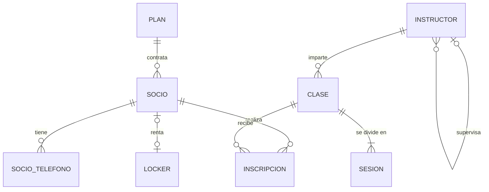

# Equipo 03 — Caso Gimnasio

**Integrantes:**
- Kevin Rodas del Angel
- Saul Canales Mendez
- Marco Antonio Hernandez Villa

## Esquema relacional

```
PLAN(**id_plan**, nombre UNIQUE, costo_mensual)
SOCIO(**num_socio**, nombre, fecha_nacimiento, correo, id_plan → PLAN)
SOCIO_TELEFONO(**num_socio** → SOCIO, **telefono**)
LOCKER(**num_locker**, ubicacion, num_socio? → SOCIO UNIQUE)
INSTRUCTOR(**num_empleado**, nombre, especialidad, num_supervisor? → INSTRUCTOR)
CLASE(**id_clase**, nombre, cupo_max, num_empleado → INSTRUCTOR)
SESION(**id_clase** → CLASE, **numero_sesion**, fecha, hora_inicio, salon)
INSCRIPCION(**num_socio** → SOCIO, **id_clase** → CLASE, **fecha_inscripcion**, estatus)
```

> Notas de lectura (según `guias/notacion.md`):
> - `**x**` = parte de la llave primaria. `→ TABLA` = llave foránea. `?` = admite NULL. `UNIQUE` = no se repite.
> - `SOCIO.id_plan → PLAN` es obligatorio (sin `?`): cada socio contrata exactamente un plan.
> - `LOCKER.num_socio? → SOCIO UNIQUE`: resuelve la relación 1:1 opcional-opcional. El `UNIQUE` garantiza que un socio no tenga dos lockers y que un locker no lo tengan dos socios. Se puso la FK en `LOCKER` porque así los lockers libres quedan con `NULL` y se identifican directo; ponerla en `SOCIO` también sería válido si se mantiene `UNIQUE` + `NULL`.
> - `SOCIO_TELEFONO` resuelve el atributo multivaluado `telefonos`.
> - `SESION` es entidad débil de `CLASE`: su PK es (`id_clase`, `numero_sesion`).
> - `INSCRIPCION` resuelve la N:M con historia: su PK es (`num_socio`, `id_clase`, `fecha_inscripcion`) para permitir reinscripción (baja en marzo, alta en junio).

## Diagrama (opcional)


