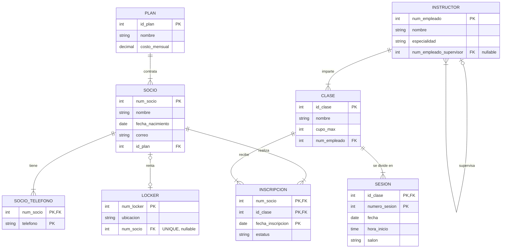

# Equipo 04 — Caso Gimnasio

**Integrantes:**
-Bribiesca Bernal Kevin Axel
-Garcia Gracia David Emanuel 
-Rico Calzadilla Rodrigo

## Esquema relacional

<!-- Usen la notación de guias/notacion.md. Una tabla por renglón. -->

PLAN(**id_plan**, nombre, costo_mensual)
SOCIO(**num_socio**, nombre, fecha_nacimiento, correo, id_plan → PLAN)
SOCIO_TELEFONO(**num_socio** → SOCIO, **telefono**)
LOCKER(**num_locker**, ubicacion, num_socio? UNIQUE → SOCIO)
INSTRUCTOR(**num_empleado**, nombre, especialidad, num_empleado_supervisor? → INSTRUCTOR)
CLASE(**id_clase**, nombre, cupo_max, num_empleado → INSTRUCTOR)
SESION(**id_clase** → CLASE, **numero_sesion**, fecha, hora_inicio, salon)
INSCRIPCION(**num_socio** → SOCIO, **id_clase** → CLASE, **fecha_inscripcion**, estatus)

## Diagrama (opcional)

